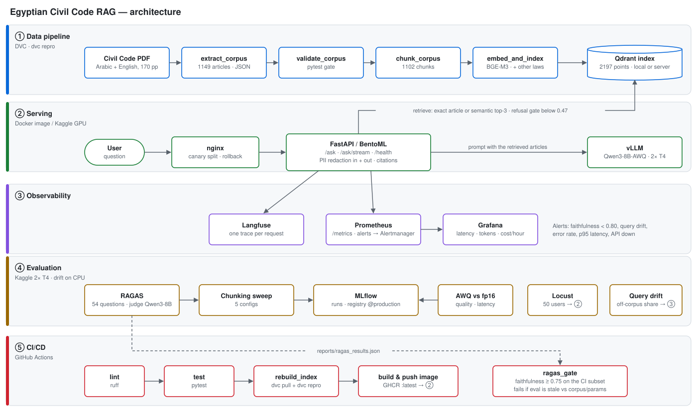
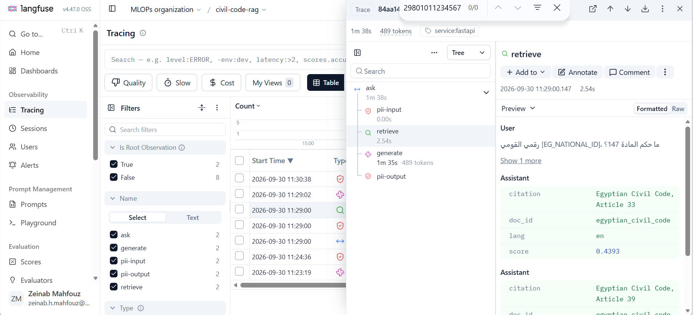
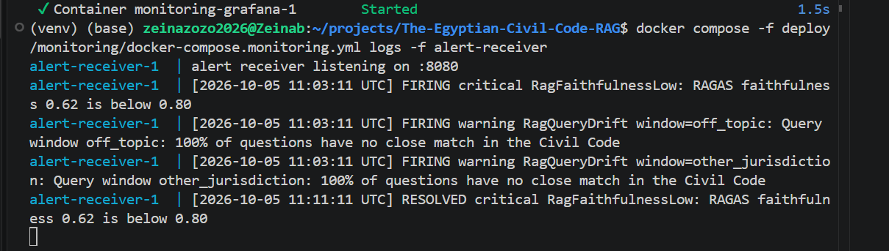
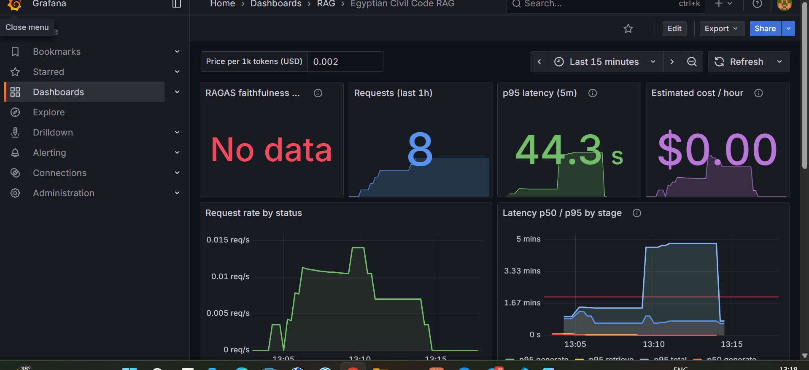

# The Egyptian Civil Code RAG

Question answering over Egypt's Civil Code (القانون المدني المصري, 1149
articles, Arabic and English) for a setting where a wrong legal answer is
unacceptable: every answer comes **only** from retrieved articles, **cites
them**, says when an article has been **repealed**, and **declines** when
the code doesn't cover the question. Built as the final project of the ITI
MLOps course.

> **Reviewing this project?** Start with [PEER_REVIEW.md](PEER_REVIEW.md): how
> to run it in 3 commands, test questions with expected answers, where the
> evidence for each rubric point is, and the review template.

## Results at a glance

| What | Result | Details |
|---|---|---|
| Answer quality (RAGAS, 54 questions, Qwen3-8B) | faithfulness **0.896**, context precision 0.908, recall 0.854 | [GPU evaluation](#gpu-evaluation-kaggle-vllm-ragas-mlflow) |
| Out-of-scope questions declined | 4 of 6 | `docs/decisions.md` |
| AWQ 4-bit vs fp16 | no quality loss (−0.002), **2.7× faster**, 2.7× less memory | [Quantization](#quantization-awq-4-bit) |
| Load, 50 concurrent users | 1,692 requests, **0 failures**, p95 12.0 s | [Load test](#load-test-locust-50-users) |
| Query drift | other-jurisdiction and off-topic questions flagged, normal ones not | [Query drift](#query-drift) |
| CI quality gate | faithfulness 0.868 ≥ 0.75 on the CI subset: **PASS** | [CI gate](#gpu-evaluation-kaggle-vllm-ragas-mlflow) |

Negative results are reported too: the first GPU evaluation scored 0.57 and
led to a real data bug; plain centroid drift was rejected because it flagged
normal questions. Both are in `docs/decisions.md`.

## Quick start (3 commands)

Needs Docker with about 8 GB of RAM, no GPU and no accounts:

```bash
git clone https://github.com/ZeinabMahfouz/The-Egyptian-Civil-Code-RAG.git && cd The-Egyptian-Civil-Code-RAG
docker compose up -d
curl http://localhost:8000/health        # healthy once the models have downloaded (first run: 5-15 min)
```

Then ask a question, or open http://localhost:8000/docs:

```bash
curl -X POST http://localhost:8000/ask -H "Content-Type: application/json" \
     -d '{"question": "What does Article 147 say?"}'
```

The image is published by CI from `main` with the vector index baked in, so
no DVC access is needed. It runs Qwen3-1.7B on CPU (30-90 s per answer); the
evaluated configuration is Qwen3-8B on vLLM (see "What runs where" in
[PEER_REVIEW.md](PEER_REVIEW.md)).

## Architecture



**How one question is answered** (`src/egyptian_civil_code_rag/`):

1. `pii.py` redacts Egyptian national IDs, phone numbers, IBANs, cards and
   emails from the question, before anything is logged or traced.
2. `query.py` retrieves: if the question names an article ("Article 147",
   "المادة ١٤٧"), an exact lookup; otherwise semantic search with BGE-M3 in
   Qdrant, deduplicated to the top 3 articles, in the question's language.
3. The prompt lists each article with its citation and repeal status, and
   states explicitly when a named article falls inside a repealed range.
4. The model (vLLM, or the CPU fallback) answers only from those articles.
5. The answer is redacted again, and the response carries `sources`
   (citations) and `pii_redacted`. Every step is a Langfuse span and a
   Prometheus metric (`pipeline.py`).

## Repository map

```
src/egyptian_civil_code_rag/   the package (pip install -e .): api.py, service.py (BentoML),
                               pipeline.py, query.py, backends.py (vLLM / CPU), pii.py,
                               metrics.py, refusal.py
scripts/                       data pipeline (extract, chunk, embed, re-index) and
                               evaluation (gpu_eval, quant_compare, embedding_drift, ragas_gate)
tests/                         pytest suite; tests/eval/ holds the 54 evaluation questions
data/                          DVC-tracked: raw PDF, interim JSON, Qdrant index; documents/
notebooks/                     Kaggle GPU notebooks: evaluation, quantization, load test
load_test/                     Locust load test
deploy/                        canary rollout (nginx), monitoring (Prometheus, Grafana, Alertmanager)
reports/                       results: RAGAS, MLflow screenshots, quantization, Locust, drift
docs/decisions.md              every design decision, failure and result, with numbers
dvc.yaml · params.yaml         pipeline stages and parameters
```

## Data pipeline

A reproducible pipeline that takes the raw bilingual PDF and produces a
validated, citable, retrieval-ready corpus:

```
data/raw/civil_code.pdf
        |
        v
[extract_corpus]   -- pdfplumber word-position column splitting (AR/EN are
        |              side-by-side columns, not stacked blocks), article
        |              boundary detection, repealed-range expansion,
        |              Arabic/English header cross-checking
        v
data/interim/civil_code.json   (1149 articles, one record each)
        |
        v
[validate_corpus]  -- pytest suite: numbering contiguity, non-empty text,
        |              no oversized records, repealed articles correctly
        |              flagged. Hard gate -- nothing downstream can run
        |              against unvalidated data.
        v
data/interim/.validated
        |
        v
[chunk_corpus]     -- article-level chunking (not fixed token windows --
        |              a legal article is a self-contained citable unit).
        |              Long multi-paragraph articles split by paragraph,
        |              parent article number preserved on every sub-chunk.
        |              Repealed-range duplicates (56 near-identical
        |              placeholder articles) collapsed to 2 chunks.
        v
data/interim/chunks.json   (1102 chunks)
```

Every stage is a `dvc.yaml` stage. `dvc repro` rebuilds the entire corpus
from the raw PDF deterministically -- no manual steps, no hidden state.

### Why extraction was hard

The source PDF's Arabic and English columns are laid out side-by-side
per physical line, not as separate blocks -- naive text extraction
interleaves both languages on every line. Getting a clean bilingual
corpus out of it required word-position-based column splitting
(pdfplumber), correcting for RTL character-reversal in the Arabic
extraction, and handling several real defects in the source document
itself (a promulgation-law preamble that reuses article numbers 1-2
before the real code starts, a repealed-article block with no header
line, a genuinely empty table cell for one article's Arabic text). Each
of these was diagnosed from real extracted data before being fixed --
see `diagnostics/README.md` for the full trail.

## Reproducing this

**Full pipeline, from source (rebuilds extraction -> chunking -> embedding -> index):**

```bash
git clone https://github.com/ZeinabMahfouz/The-Egyptian-Civil-Code-RAG.git
cd The-Egyptian-Civil-Code-RAG
python3 -m venv .venv && source .venv/bin/activate
pip install -r requirements.txt
sudo apt install poppler-utils   # pdftotext/pdfinfo, required by extraction

dvc pull      # fetch the DVC-tracked raw PDF and pipeline outputs
dvc repro     # rebuild everything from source, verifying it reproduces
```

**Build the image yourself** (instead of pulling it): `dvc pull` fetches the
vector store the Dockerfile bakes in, then `docker compose up --build`.

Configure your own DVC remote first if you're not pulling from the
project's existing one. The remote is Google Drive via a personal
OAuth client, not a service account -- see the "DVC remote" entry in
`docs/decisions.md` for why, and for the exact setup steps if you're
reproducing this from scratch on a new machine.

**Generative model:** the Docker image runs Qwen3-1.7B on CPU with
`transformers`. With a GPU, point the same app at a vLLM server: set
`VLLM_BASE_URL` and `GEN_MODEL` (e.g. `Qwen/Qwen3-8B-AWQ`).

## Adding a legal document

Additional laws are indexed alongside the Civil Code from `data/documents/`
(the schema is in `scripts/documents.py`, and the folder has its own README).
Copy the text from an official source and name that source in the file.

```bash
python scripts/reindex_batch.py --dry-run data/documents/<doc_id>.json   # validate only
# stop the API first -- local Qdrant is single-process
python scripts/reindex_batch.py data/documents/<doc_id>.json             # add or update
```

`dvc repro` rebuilds the same index from scratch, including every file in
`data/documents/`.

## Canary rollout

A new release does not replace the running one all at once. It is
deployed next to it, and nginx sends it a small, fixed share of traffic
while the two are compared. Everything is in `deploy/canary/`:

| File | Purpose |
|---|---|
| `docker-compose.canary.yml` | `api-stable` + `api-canary` (two CI-built images, pinned by git SHA) behind `nginx` on port 8080 |
| `default.conf.template` | Weighted upstream (`STABLE_WEIGHT` / `CANARY_WEIGHT`), JSON access log recording which release served each request |
| `.env.example` | Images, release names, and the current stage's weights |
| `canary_report.py` | Reads the access log, compares canary vs stable, exits 0 = promote / 1 = hold or roll back |

Every API response carries an `X-App-Release` header, and `/health` includes
`release`. That is how the log, and you, can tell which build answered.

**Rollout stages:**

| Stage | `STABLE_WEIGHT` / `CANARY_WEIGHT` | Minimum before moving on |
|---|---|---|
| 0. Pre-flight | - | CI green on the canary SHA; RAGAS faithfulness on the canary image >= 0.75 (the CI gate) |
| 1. Canary 5% | 95 / 5 | >= 20 canary `/ask` requests and all `canary_report.py` gates pass |
| 2. Canary 25% | 75 / 25 | gates pass again on the new window |
| 3. Canary 50% | 50 / 50 | gates pass; spot-check 10 canary answers for correct citations |
| 4. Promote | set `STABLE_IMAGE` to the canary SHA, `CANARY_STATE=down` | - |

**Gates** (`canary_report.py`, adjustable by flag):

- The canary's 5xx rate is at most the stable rate plus 1 percentage point.
- The canary's `/ask` p95 latency is at most 1.2 times the stable p95.
- There is enough canary traffic to judge.

A failure that has no release header (an app crash or an nginx 502) is
attributed by upstream address, so a crashing canary can't hide from the
error gate.

**Commands:**

```bash
cp deploy/canary/.env.example deploy/canary/.env      # fill in the two SHAs
docker compose -f deploy/canary/docker-compose.canary.yml --env-file deploy/canary/.env up -d
# ...send traffic to http://localhost:8080 ...
python deploy/canary/canary_report.py deploy/canary/logs/canary_access.log
# next stage: edit the weights in .env, then apply without restarting the APIs:
docker compose -f deploy/canary/docker-compose.canary.yml --env-file deploy/canary/.env up -d nginx
```

**Rollback:** set `CANARY_STATE=down` in `.env` and re-run the last command.
nginx then stops routing to the canary. The canary container keeps running
so its logs can be inspected. If the canary crashes outright, `max_fails=3`
takes it out of rotation automatically for 30 s at a time, which limits
users to about 3 failed requests per window until you roll back.

**Resource note:** each API container loads Qwen3-1.7B and BGE-M3 (about
6 GB of RAM), so the full stack needs roughly twice the memory of the
single-container setup.

## Serving with BentoML

The BentoML service (`src/egyptian_civil_code_rag/service.py`) wraps the same
RAG engine and PII guard behind an async `/ask`. It runs in its own
environment, separate from the pipeline's (see docs/decisions.md):

```bash
python3 -m venv .venv-serve && source .venv-serve/bin/activate
pip install -r requirements-serve.txt && pip install -e . --no-deps
bentoml serve egyptian_civil_code_rag.service:CivilCodeRAG   # stop any other API first
```

Open http://localhost:3000 for the interactive API page, or:

```bash
curl -X POST http://localhost:3000/ask -H "Content-Type: application/json" \
     -d '{"question": "What does Article 147 say?"}'
curl -X POST http://localhost:3000/health
```

## Streaming answers

Both servers can stream the answer as it's generated instead of waiting a
minute or more for the whole thing:

```bash
# FastAPI: Server-Sent Events -- token events, then a final "done" event with sources
curl -N -X POST http://localhost:8000/ask/stream -H "Content-Type: application/json" \
     -d '{"question": "What does Article 147 say?"}'

# BentoML: plain text chunks, citations on the last line
curl -N -X POST http://localhost:3000/ask_stream -H "Content-Type: application/json" \
     -d '{"question": "What does Article 147 say?"}'
```

PII is redacted in the stream too, even when a number is split across
tokens (see docs/decisions.md). The text therefore arrives about 64
characters behind the model.

## Observability (Langfuse)

Every `/ask` is traced to a self-hosted Langfuse instance when its keys are set:

```bash
# Langfuse itself: official compose file, outside this repo
git clone https://github.com/langfuse/langfuse.git ~/langfuse && cd ~/langfuse
docker compose up -d                       # UI at http://localhost:3000

# this repo: put the project's API keys in .env (git-ignored)
LANGFUSE_PUBLIC_KEY=pk-lf-...
LANGFUSE_SECRET_KEY=sk-lf-...
LANGFUSE_BASE_URL=http://localhost:3000

set -a; source .env; set +a
uvicorn egyptian_civil_code_rag.api:app --port 8000
```



## Monitoring (Prometheus, Grafana, Alertmanager)

The FastAPI app exposes Prometheus metrics at `GET /metrics`: request count
by status, latency per stage (total / retrieve / generate), LLM tokens in and
out, PII redactions by entity type, best-chunk retrieval similarity, the
latest RAGAS faithfulness, and the latest query-drift check.
`deploy/monitoring/` runs Prometheus, a pre-provisioned Grafana dashboard
and Alertmanager against it:

```bash
uvicorn egyptian_civil_code_rag.api:app --host 0.0.0.0 --port 8000   # the API, on the host
docker compose -f deploy/monitoring/docker-compose.monitoring.yml up -d
```

- Grafana: http://localhost:3001 (admin / admin), dashboard **Egyptian Civil Code RAG**
- Prometheus: http://localhost:19090 (`/targets` for the scrape, `/alerts` for the rules)
- Alertmanager: http://localhost:19093 (alerts received, grouping, silences)

**Cost per hour** is `tokens per hour / 1000 x price per 1k tokens`. The price
is a dashboard variable (default $0.002) because a self-hosted model has no
per-token bill. Set it to a hosted-API equivalent or to your GPU cost per
1k tokens.

**Alerts** (`deploy/monitoring/prometheus/alerts.yml`):

| Alert | Condition |
|---|---|
| `RagFaithfulnessLow` | latest RAGAS faithfulness < 0.80 |
| `RagHighErrorRate` | > 5% of `/ask` requests failing for 5 min |
| `RagSlowP95` | p95 latency > 120 s for 5 min (CPU backend; tighten for vLLM) |
| `RagApiDown` | `/metrics` unreachable for 1 min |
| `RagQueryDrift` | a query window has too many questions with no close match among the indexed articles (see Query drift) |

**Delivery.** Prometheus sends firing alerts to Alertmanager, which groups
them by alert name, waits 10 s, and posts them to a webhook. The webhook is
a small standard-library receiver (`deploy/monitoring/alert-receiver/`) that
writes one line per alert, so delivery works without an email or Slack
account. Critical alerts repeat every hour while firing, warnings every 4
hours, and a "RESOLVED" line follows when an alert clears. For a real team,
replace the webhook in `alertmanager/alertmanager.yml` with `email_configs`
or `slack_configs`; the routing stays the same.

**Demo: see an alert delivered.** The committed RAGAS report scores 0.896,
so `RagFaithfulnessLow` is quiet. `RAGAS_REPORT` points the API at a demo
report below the threshold (`deploy/monitoring/demo/`, marked DEMO ONLY):

```bash
RAGAS_REPORT=deploy/monitoring/demo/ragas_low_faithfulness.json \
  uvicorn egyptian_civil_code_rag.api:app --host 0.0.0.0 --port 8000
docker compose -f deploy/monitoring/docker-compose.monitoring.yml up -d
docker compose -f deploy/monitoring/docker-compose.monitoring.yml logs -f alert-receiver
```

Within about a minute the receiver prints (from a local run):

```
[2026-10-05 09:48:01 UTC] FIRING warning RagQueryDrift window=off_topic: Query window off_topic: 100% of questions have no close match in the Civil Code
[2026-10-05 09:48:01 UTC] FIRING warning RagQueryDrift window=other_jurisdiction: Query window other_jurisdiction: 100% of questions have no close match in the Civil Code
[2026-10-05 09:48:01 UTC] FIRING critical RagFaithfulnessLow: RAGAS faithfulness 0.62 is below 0.80
[2026-10-05 09:49:01 UTC] RESOLVED critical RagFaithfulnessLow: RAGAS faithfulness 0.62 is below 0.80
```

The two drift alerts come from the committed `reports/drift.json`, whose
simulated windows are off-corpus on purpose; `in_domain` stays quiet. The
same lines are in `deploy/monitoring/alert-receiver/logs/alerts.log`.
The RESOLVED line is from restarting the API without `RAGAS_REPORT`.





## GPU evaluation (Kaggle): vLLM, RAGAS, MLflow

The laptop has no GPU, so generation with Qwen3-8B, RAGAS scoring and the
MLflow chunking sweep run in `notebooks/kaggle_gpu_eval.ipynb` on Kaggle
(T4 x2):

- **vLLM** serves `Qwen/Qwen3-8B` (fp16, tensor-parallel 2) behind an
  OpenAI-compatible API, as both the generator and the RAGAS judge.
- **`scripts/gpu_eval.py sweep`**: 5 chunking configs (paragraph-split
  threshold 400 / 700 / 1200 / whole articles, repealed-range dedupe on/off),
  each scored on the 20-question CI subset and logged to MLflow.
- **`scripts/gpu_eval.py full`**: the best config on all 54 questions and all
  4 RAGAS metrics, registered as `civil-code-rag-chunking@production`.

The API can use the same vLLM server: set `VLLM_BASE_URL=http://<host>:8000/v1`
and `GEN_MODEL=Qwen/Qwen3-8B` before starting uvicorn or BentoML. Without
them, it falls back to the local CPU model.

**Results** (full run, 54 questions, Qwen3-8B as generator and judge):

| Faithfulness | Context precision | Context recall | Article hit rate | Out-of-corpus declined |
|---|---|---|---|---|
| **0.896** | 0.908 | 0.854 | 0.917 | 4 of 6 |

The sweep found no chunking config meaningfully better than the current
one (best challenger +0.044 faithfulness, below the 0.05 needed), so
`baseline-700` stayed in production. Full tables, the before/after of the
evaluation fixes, and known limits are in `docs/decisions.md`. MLflow
screenshots: `reports/mlflow_comparison.png`, `reports/mlflow_registry.png`.

**CI gate** (`ragas_gate` job): `scripts/ragas_gate.py` fails the build if
faithfulness on the 20-question CI subset is below 0.75, or if fewer than
75% of its out-of-corpus questions were declined. It also fails if the
committed evaluation is stale, meaning it was run against a different
corpus or different chunking/embedding params than the repo now has.
Current result: faithfulness 0.868, 3 of 4 declined, **PASS**.

## Quantization (AWQ 4-bit)

`Qwen/Qwen3-8B-AWQ` against fp16 on the same 54 questions, both judged by the
fp16 model (`scripts/quant_compare.py`, `notebooks/kaggle_quantization.ipynb`):

| | fp16 | AWQ 4-bit |
|---|---|---|
| Faithfulness | 0.886 | 0.888 (drop −0.002 < 0.03: **PASS**) |
| Latency p50 / p95 | 2.81 s / 9.42 s | 1.06 s / 2.51 s |
| Throughput, 8 concurrent users | 2.24 req/s | 4.21 req/s |
| Weights per GPU | 7.64 GiB | 2.85 GiB |

No measurable quality loss, ~2.7x lower latency, ~2.7x less weight memory,
so AWQ is the serving model. Full table and reasoning:
`reports/quantization.md`, `docs/decisions.md`.

## Load test (Locust, 50 users)

FastAPI + Qwen3-8B-AWQ on vLLM (2x T4), questions from the eval set, 0.5–2 s
think time (`load_test/locustfile.py`, `notebooks/kaggle_load_test.ipynb`):

| Users | Requests | Failures | Throughput | p50 | p95 | p99 |
|---|---|---|---|---|---|---|
| 1 | 47 | 0 | 0.40 req/s | 1.2 s | 2.2 s | 2.5 s |
| 50 | 1,692 | 0 | 5.65 req/s | 7.0 s | 12.0 s | 15.0 s |

No failures. It saturates at about 5.7 requests/s; under load, retrieval
takes 38% of the time. Reports: `reports/locust_u50.html`,
`reports/load_test.md`; analysis in `docs/decisions.md`.

**Retrieval under load.** Benchmarking the vector store alone
(`scripts/retrieval_bench.py`) showed that local Qdrant filters in Python
and serves one request at a time. Two fixes: the same-language copy of an
article is fetched by its ID instead of by a filtered scan, and an optional
Qdrant server with payload indexes. Re-run at 50 users on Kaggle
(`notebooks/kaggle_load_test_qdrant.ipynb`):

| 50 users, 5 min | Requests/s | p50 | Max | Retrieve (mean) | Generate (mean) |
|---|---|---|---|---|---|
| before | 5.65 | 7.0 s | 18.1 s | 2.45 s | 4.02 s |
| twin by ID, local Qdrant | 6.84 | 5.0 s | 20.0 s | 0.40 s | 5.13 s |
| **twin by ID, Qdrant server** | **7.30** | **4.6 s** | **14.0 s** | **0.13 s** | 5.07 s |

Retrieval is 19x faster and throughput is up 29%, with 0 failures. The
bottleneck is now generation on the GPU (`reports/load_test_qdrant.md`,
analysis in `docs/decisions.md`). To run with the Qdrant server:

```bash
docker compose -f docker-compose.yml -f docker-compose.qdrant.yml up -d   # API + Qdrant server
python scripts/retrieval_bench.py --url http://localhost:6333            # benchmark against it
```

## Query drift

Are users asking what the system was evaluated on? `scripts/embedding_drift.py`
compares batches of queries with the eval set (BGE-M3). The alerting signal is
the share of questions with no close match among the indexed articles, with a
cut-off and limit calibrated on the eval questions:

| Window (16 questions each) | Below cut-off | Flagged |
|---|---|---|
| New Civil Code questions | 2 | no |
| Other jurisdictions (Saudi labour law, Egyptian criminal/tax law) | 16 | **yes** |
| Off topic | 16 | **yes** |

Plain centroid drift was tried first and rejected for alerting: it flagged
normal questions because it reacts to phrasing. Details in `docs/decisions.md`,
report in `reports/drift.md`, alert `RagQueryDrift`.

## Changelog

Built incrementally; each stage was a set of reviewed pull requests with CI
green. The full reasoning, including what didn't work, is in
`docs/decisions.md`.

| Stage | What was added |
|---|---|
| 1 · Data and retrieval | PDF → 1149 validated articles (bilingual column splitting, repealed ranges); article-level chunking; BGE-M3 + Qdrant; query engine with exact article lookup and citation-only sources; FastAPI `/ask` + `/health` with Pydantic; Docker |
| 2 · MLOps foundation | DVC pipeline with a Google Drive remote; GitHub Actions (lint → test → `dvc repro` → image to GHCR); 54-question evaluation set; first RAGAS attempt on CPU (failed, documented) |
| 3 · Serving | Batch re-indexing of new laws; PII redaction (Egyptian ID, phone, IBAN, card, email) in questions and answers; canary rollout with nginx and promotion gates; BentoML service |
| 4 · Observability | Langfuse tracing (no raw PII in traces); Prometheus metrics, Grafana dashboard, alert rules; streaming (`/ask/stream`) with PII-safe incremental redaction; Arabic lam-alef extraction fix |
| 5 · GPU evaluation and optimization | vLLM + Qwen3-8B on Kaggle; RAGAS on 54 questions; MLflow 5-config sweep and registry; CI RAGAS gate with staleness check; evaluation fixes (repeal-flag data bug, same-language retrieval, judge context, refusal scoring); AWQ 4-bit; Locust at 50 users; query-drift check |
| 6 · Review readiness | Public image, 3-command setup without DVC, peer review guide and issue template, repealed-range fix found in the reviewer dry run, architecture diagram |
| 7 · After submission | Alerts delivered through Alertmanager; drift alert switched to the off-corpus share; retrieval 2.45 s → 0.13 s at 50 users (same-language lookup by ID, optional Qdrant server), +29% throughput; CI reads the DVC remote with a read-only service account (no weekly token renewal) |
